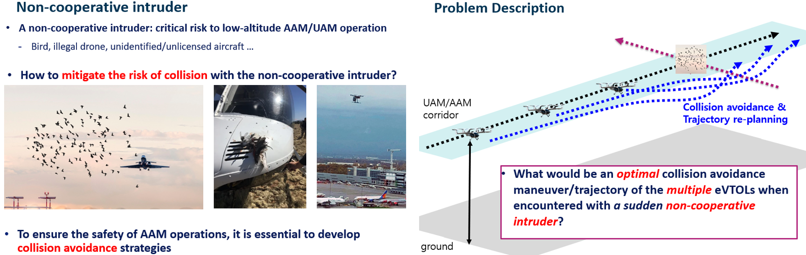
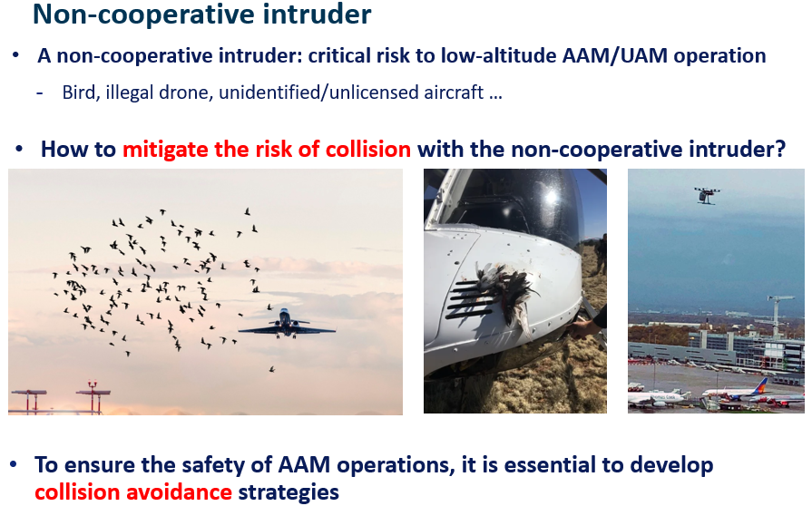
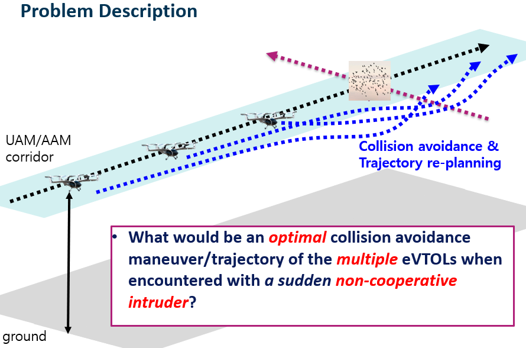
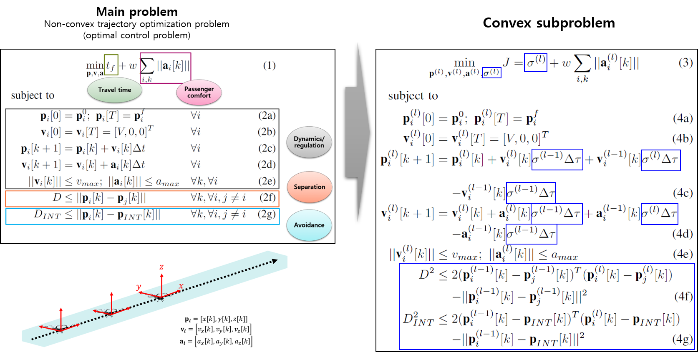
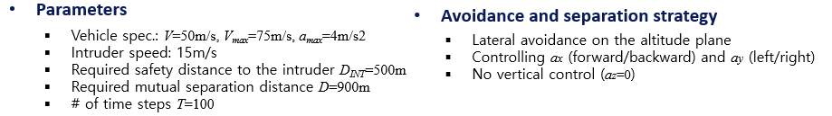
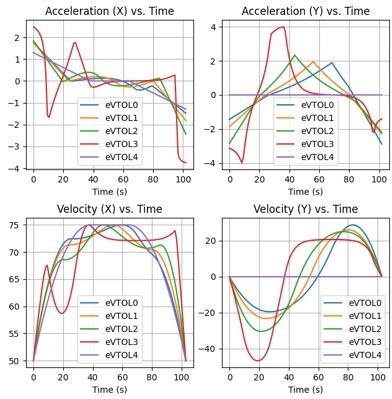
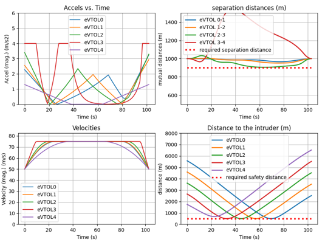
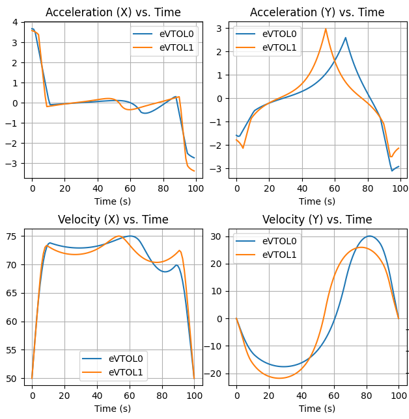
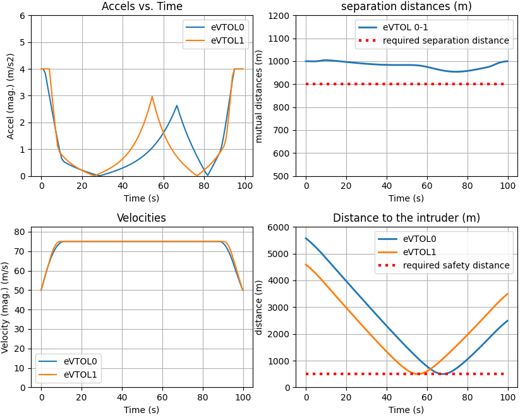

# 2023_ICTC_KSAS
convex optimization for multi-eVTOL collision avoidance trajectory planning against a non-cooperative intruder

## Scenario description

<!-- 
 -->

## Formulation

## Optimization results

### N=5 case
- collision avoidance trajectory

<!--  -->

- optimized state/control history
<!--  -->

### N=2 case
- collision avoidance trajectory

<!--  -->

- optimized state/control history
<!--  -->

#### request for source code: uhchoi2132@gmail.com

